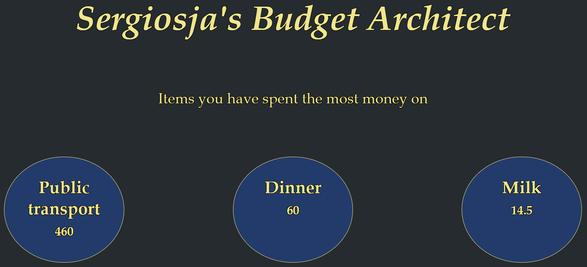
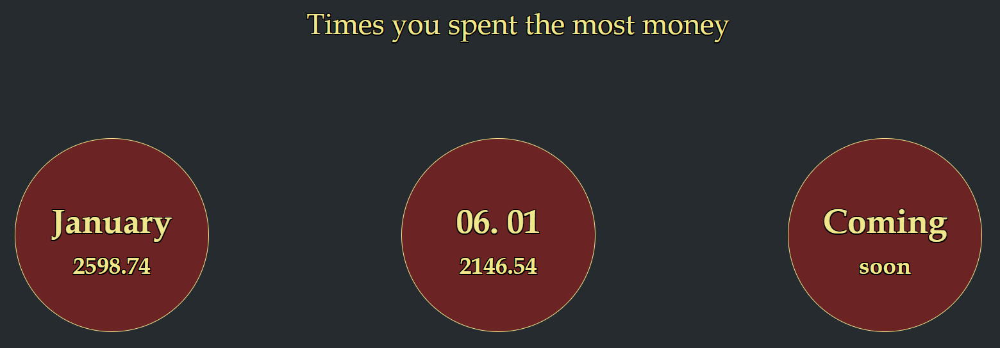

# Budget Architect

## Main idea

I started writing a template in Excel for my budget in 2021. I have never done this before, and figured it was well over-due. About 10 minutes in I thought to myself, "I bet I could automate this somehow". 2 days later I had built this program.

Now, of course, this program is not *really* an automation. Not a very impactful one at least. If anything, it is just an Excel spreadsheet that requires an internet connection. The GUI is nice though.

 

## Fundamentals

The front end is written in HTML/EJS and CSS, while the backend is JavaScript with Node.js. You can view dependencies in the JSON file.

I decided to go with PostgreSQL as my database, as it is a free, easy to use and highly scalable.

 

### Login / Signup

The index page is a simple login. If you lack an account, sign up for one with the button below. The passwords are salted and hashed adequately before they are stored in the database.

 

### Menu

The main menu gives you 3 options: Go to \*current month*, see some stats, or choose a specific month for overview. I assumed the current month would always be the most relevant one.

The name will change to your username when you log in.

 

### Current month

Here you have 7 options, though most of them are similar. You can add, alter and delete receipts (right). You have these three options for incomes as well (left).

Here you add the source (where you bought it/who paid you), the matter (what you bought/why someone gave you money), the category (you decide this), and how much money it cost (**PS!** Floats are allowed, but they must be dots).

Because I realise that you rarely only buy 1 item when you go shopping, I have added an "Add 5" and an "Add 10" button, so that you won't have to go back and re-write the source name 10 times. I guess this is the only "automated" part of the program.

The last option is to see an overview (centre) of the current month.

 

### Overview

The first thing you see is the amount you have earned (left), spent (right), and the difference of these (centre), all in NOK. If you scroll down, you will see a rather detailed history of the month. This is also where you will find the receipt IDs, which you use to alter and delete receipts. The date is 24 hours late, and I honestly have no idea why. My JavaScript shows me the right date when I console log it, and so does the database when I do queries directly in Postgres.

Even though I have not included it in every picture, the "back" button is available everywhere.

**PS!** To delete or alter a receipt/income you use the ID attatched to the one you want. This option is only found in the \*current month* section, though you can change any receipts/incomes. I just figured it would be reduntant to add this option in the big overview, as the functionality would be identical anyway.

 

### Stats

If you select the "2021 Stats" option from the menu, you will see fifteen balls with information. These contain the Top 3 items and categories you have spent the most money on, your Top 3 income sources and categories, and finally the month and day in 2021 you spent the most money on.

Holding your mouse over a section will force a background change.

 

### Flaws / Known bugs

The most obvious flaw here is that, as I mentioned in the beginning, nothing is *really* automated. But it will make you more aware of how you spend your money!

The date thing in the monthly history display. Any help to fix that is very much appreciated!
