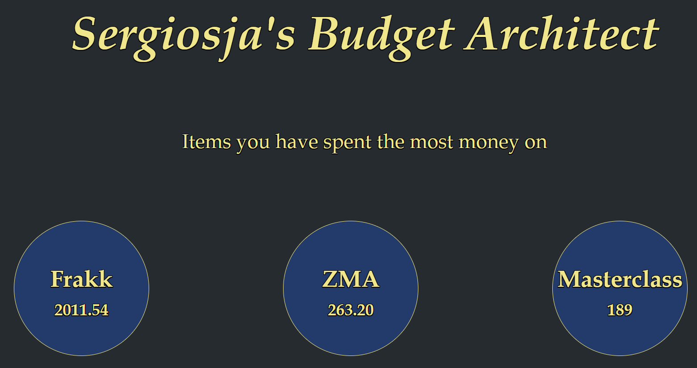

# Budget Architect

## Main idea

I started writing a template in Excel for my budget in 2021. I have never done this before, and figured it was well over-due. About 10 minutes in I thought to myself, "I bet I could automate this somehow". Now, of course, this program is not *really* an automation. Not a very impactful one at least. If anything, it is just an Excel spreadsheet that requires an internet connection (the GUI is fancy though!).

## Why not just use the app issued by your bank?

Like most other people, I have an app for my bank. There I can access my entire economy in one, an extremely clear GUI which allows you to navigate anything from your loans to your savings. It also allows you to see exactly how much you spent, which days and where you went shopping. In addition to everything else you should be doing with a bank. Very impressive and respectable.

*Aaand* that is actually part of the problem for me… Yes, you have a clear view of nearly everything. But I lack a sense of "real" control. I could easily remain ignorant about my economy by simply refraining from checking it. Which happens too often due to the advanced log-in system (though, obviously, due to security reasons, I am very happy it is the way it is).

My target was to have more *control*. I want to be aware of how much money I spend, and how much money comes in. In addition, I wanted to be more aware of *what* exactly I spend my money on.

## What exactly *is* your program then?

I'm glad you asked!

### Fundamentals

The front end is written in HTML/EJS and CSS, while the backend is NodeJS with ExpressJS. You can view dependencies in the JSON file.

I decided to go with PostgreSQL as my database, as it is a free, easy to use and highly scalable.

### Login / Signup

The index page is a simple login. If you lack an account, sign up for one with the button below. Make sure your passwords match and are secure, and, viola! The passwords are, of course, both salted and hashed adequately before they are stored in the database. Made an account yet? Great! Now sign up and let’s move on.

### Menu

The main menu gives you 3 options: Go to \*current month*, see some stats, or choose a specific month for overview. The overview lets you navigate through every month of the year, while \*current month* lets you access the current month instantly. Because I assume the current month will always be the most relevant one. I will explain the stats further down.

The name will change to your username when you log in.

### Current month

Here you have 7 options, though most of them are similar. You can add a new receipt consisting of one item, alter a receipt or delete one altogether (right). You have these three options for incomes as well (left). Here you add the source (where you bought it/who paid you), the matter (what you bought/why someone gave you money), the category (you decide this), and how much money it cost (**PS!** Floats are allowed, but they **must** be **dots** and **not commas**). I figured quantity would be unnecessary, because if you bought 30 NOK worth of blueberries, isn’t that enough? Do you *really* care *how many* you bought? Trust me, the first week of January you might miss this, but you will not go an entire calendar year counting every individual berry. Let’s be real…

Example → Source: Coop. Matter: Bread. Category: Food. Cost: 34.25.

Because I realise that you rarely only buy 1 item when you go shopping, I have added an "Add 5" and an "Add 10" button, so that you won't have to go back and write the source-name 10 times. I needed seperate sections to prevent faulty results being sent to the database. I guess this is the only "automated" part of the whole program.

The last option is to see an overview (centre) of the current month, which is also what you will see if you click on a month from the "Months 2021"-section from the menu (though here you can select any month of the year).

### Overview

The first thing you see is the amount you have earned (left), spent (right), and the difference of these (centre), all in NOK. If you scroll down, you will see a rather detailed history of the month. This is also where you will find the receipt IDs, which you use to alter and delete receipts. The date is 24 hours late, and I honestly have no idea why. My JavaScript shows me the right date when I console log it, and so does the database when I do queries directly in Postgres.

Even though I have not included it in every picture, the "back" button is, of course, available everywhere.

**PS!** To delete or alter a receipt/income you use the ID attatched to the one you want. This option is only found in the \*current month* section, though you can change any receipts/incomes. I just figured it would be reduntant to add this option in the big overview, as the functionality would be identical anyway.

### Stats

If you select the "2021 Stats" option from the menu, you will see fifteen balls with information. These contain the Top 3 items and categories you have spent the most money on, your Top 3 income sources and categories, and finally the month, week and day in 2021 you spent the most money on.

Holding your mouse over a section will force a font size increase and background change.

### Flaws / Known bugs

The most obvious flaw here is that, as I mentioned in the beginning, nothing is *really* automated. This *is* an excel sheet with a fancy GUI. And if I’m being totally frank, it’s not even that fancy. Though it **_will_** make you more aware of your economy. You will be forced to keep receipts (or at least remember what you bought). You will constantly be aware of what you are buying and how much you are spending. It is easy to buy unnecessary things when you do it unconsciously, but writing it down every night and seeing [unnecesarry item], [item you already have too many of] and [why on earth did you buy this?] at the top of your monthly summary might send some signals.

 

Oh and yes, of course, the date thing in the monthly history display. Any help to fix that is very much appreciated!